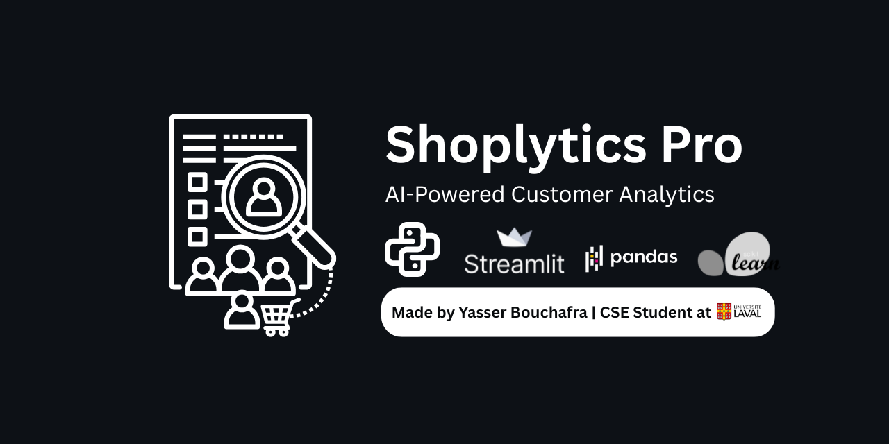
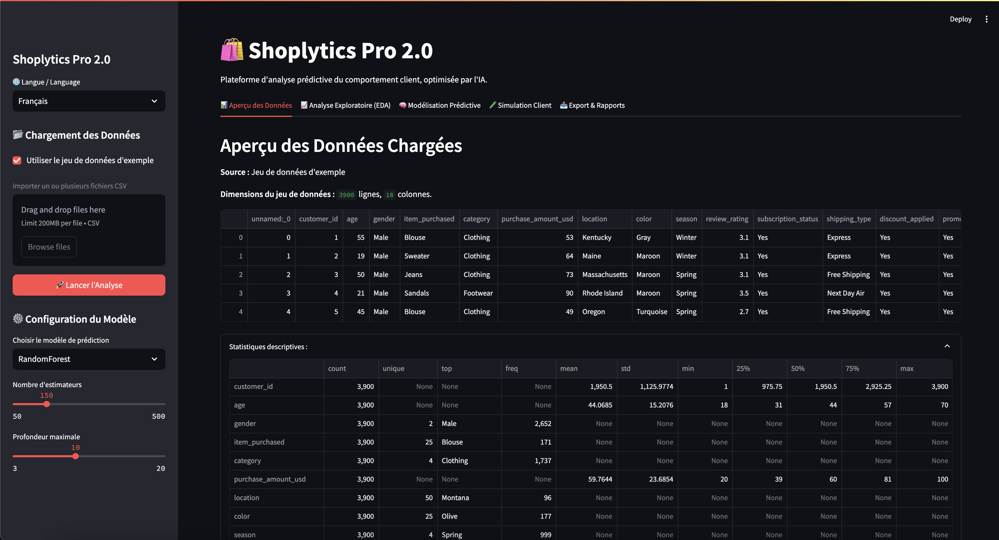
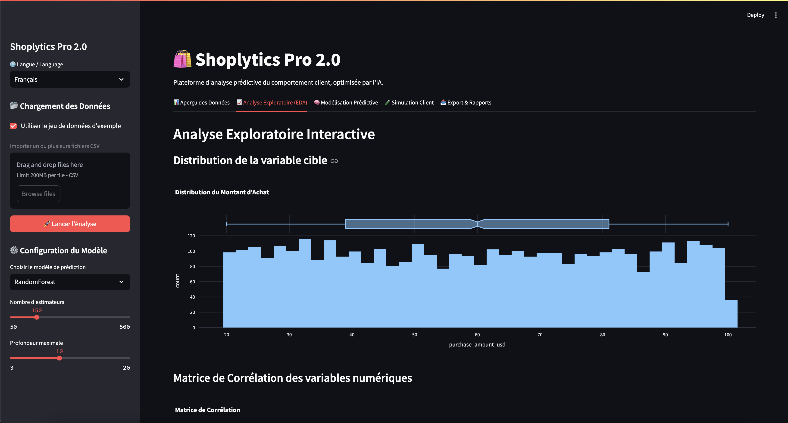
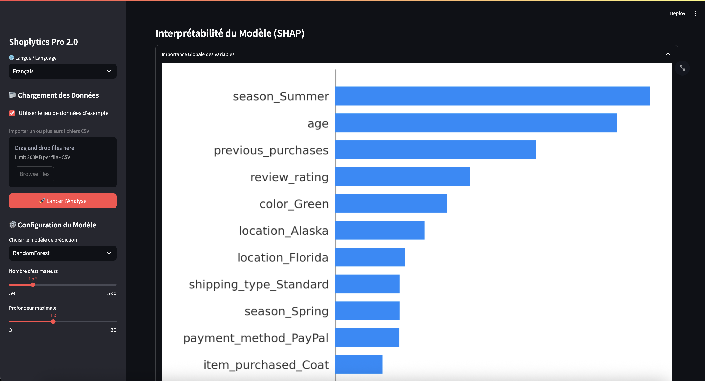
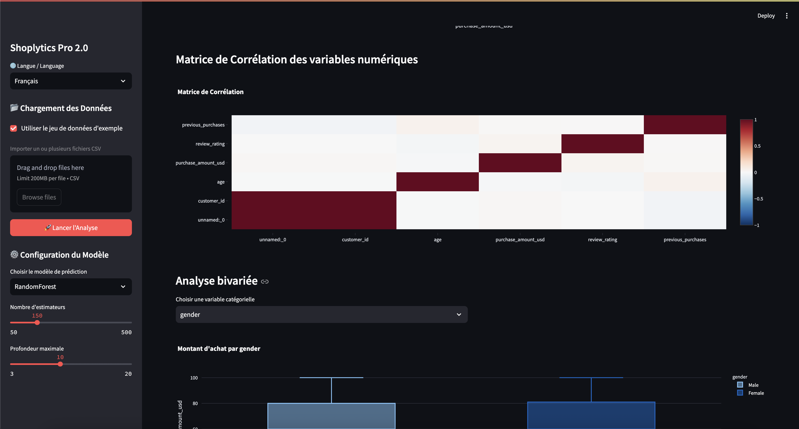
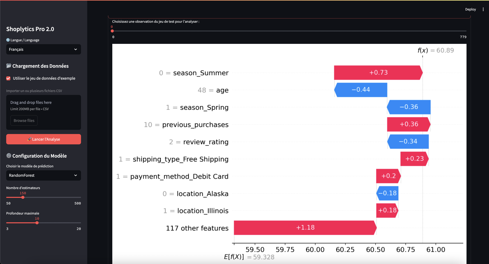
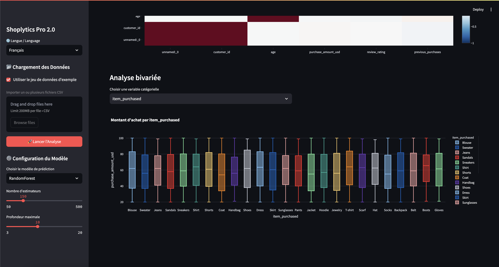
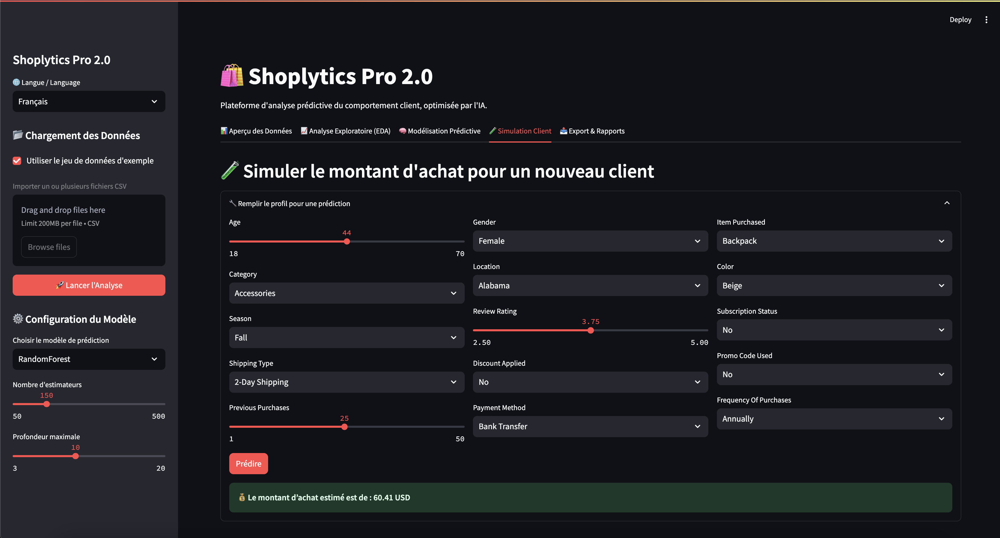
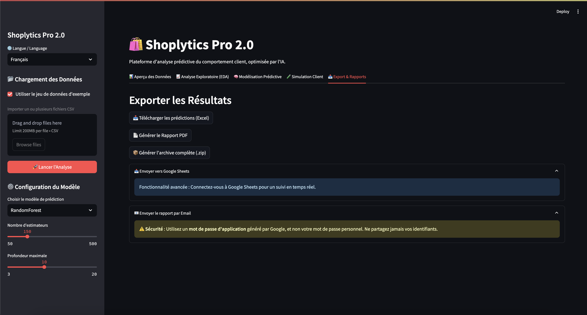

<p align="center">
  
</p>

# Shoplytics Pro 2.0 🛍️ - Plateforme d'Analyse Prédictive Client


**[Voir la Démo Live](https://shoplytics-pro-analysis.streamlit.app/)**

**Shoplytics Pro** est une application web d'analyse de données et de Machine Learning conçue pour les professionnels de l'e-commerce et du marketing. Elle permet de transformer des données de ventes brutes en insights stratégiques et en prédictions de comportement client, le tout via une interface intuitive et interactive.

Cette plateforme permet à un utilisateur de charger ses propres données de ventes, d'explorer des visualisations dynamiques, d'entraîner des modèles d'IA avancés (RandomForest, XGBoost, LightGBM) pour prédire le montant d'achat d'un client, et d'interpréter les résultats pour prendre des décisions éclairées.

---

## 📸 Galerie de l'Application

<details>
<summary><b>Cliquez pour voir les captures d'écran</b></summary>
  
| Aperçu & EDA                                      | Modélisation & Interprétabilité                        |
| :------------------------------------------------: | :----------------------------------------------------: |
|  |  |
|  |    |
|  |      |
|  |        |
|                                                    |              |

</details>

---

## ✨ Fonctionnalités Clés

*   **📊 Tableau de Bord Interactif** : Interface multi-onglets construite avec Streamlit pour une navigation fluide.
*   **📂 Chargement de Données Flexible** : Importez un ou plusieurs fichiers CSV, ou utilisez le jeu de données d'exemple intégré.
*   **🤖 Choix de Modèles d'IA** :
    *   Random Forest Regressor
    *   XGBoost Regressor
    *   LightGBM Regressor
*   **⚙️ Tuning d'Hyperparamètres** : Ajustez en temps réel le nombre d'estimateurs et la profondeur des arbres pour optimiser le modèle.
*   **📈 Visualisations Dynamiques** : Explorez les données avec des graphiques interactifs (histogrammes, box plots, matrices de corrélation) générés par Plotly.
*   **🧠 Interprétabilité Avancée avec SHAP** :
    *   Visualisez l'**importance globale** des variables sur l'ensemble des prédictions.
    *   Analysez en détail une **prédiction individuelle** avec les graphiques *Waterfall* pour comprendre le "pourquoi" derrière une décision de l'IA.
*   **🧪 Simulation "What-If"** : Créez le profil d'un nouveau client et obtenez une prédiction instantanée de son montant d'achat potentiel.
*   **📤 Export Multi-Format** :
    *   Téléchargez les résultats des prédictions au format **Excel**.
    *   Générez un **rapport PDF professionnel** incluant métriques et graphiques.
    *   Créez une **archive ZIP complète** contenant toutes les données et les résultats.
*   **🌍 Interface Multilingue** : Supporte le Français et l'Anglais.

---

## 📈 Analyse des Résultats

Avec le jeu de données d'exemple (`shopping_trends_final.csv`), le modèle obtient un **score R² négatif**. Ce n'est pas un bug, mais un résultat d'analyse important.

**Qu'est-ce que cela signifie ?**
Un R² négatif indique que les prédictions du modèle sont moins performantes qu'un simple modèle qui prédirait systématiquement la moyenne des montants d'achat. Cela suggère que les variables disponibles (catégorie, âge, saison, etc.) **ne contiennent pas suffisamment d'informations prédictives fortes** pour expliquer la variance du montant d'achat.

**Pistes d'Amélioration :**
1.  **Ingénierie de Caractéristiques (Feature Engineering)** : Créer de nouvelles variables plus pertinentes (ex: `age_group`, `purchase_frequency`, etc.).
2.  **Collecte de Données** : Enrichir le dataset avec des informations plus granulaires (ex: historique de navigation, temps passé sur la page produit, etc.).
3.  **Tuning plus poussé** : Utiliser des techniques comme `GridSearchCV` ou `Optuna` pour trouver une meilleure combinaison d'hyperparamètres.

L'application remplit donc son rôle : elle permet non seulement de modéliser, mais aussi de **diagnostiquer la qualité prédictive d'un jeu de données**.

---

## 🛠️ Stack Technologique

*   **Application Web** : [Streamlit](https://streamlit.io/)
*   **Manipulation de Données** : [Pandas](https://pandas.pydata.org/), [NumPy](https://numpy.org/)
*   **Machine Learning** : [Scikit-learn](https://scikit-learn.org/), [XGBoost](https://xgboost.ai/), [LightGBM](https://lightgbm.readthedocs.io/)
*   **Visualisation de Données** : [Plotly](https://plotly.com/python/), [Matplotlib](https://matplotlib.org/), [Seaborn](https://seaborn.pydata.org/)
*   **Interprétabilité du Modèle** : [SHAP](https://shap.readthedocs.io/)
*   **Génération de PDF** : [FPDF2](https://pyfpdf.github.io/fpdf2/)

---

## 🚀 Installation et Lancement

Pour lancer ce projet en local, suivez ces étapes :

1.  **Clonez le dépôt**
    ```bash
    git clone https://github.com/yasserbouchafra/Shoplytics-Pro-Analysis-Platform.git
    cd Shoplytics-Pro-Analysis-Platform
    ```

2.  **Créez et activez un environnement virtuel** (recommandé)
    ```bash
    # Créer l'environnement
    python -m venv venv

    # Activer sur macOS/Linux
    source venv/bin/activate

    # Activer sur Windows
    # venv\Scripts\activate
    ```

3.  **Installez les dépendances**
    Le fichier `requirements.txt` contient toutes les bibliothèques nécessaires.
    ```bash
    pip install -r requirements.txt
    ```

4.  **Lancez l'application Streamlit**
    Assurez-vous que votre environnement virtuel est activé.
    ```bash
    python -m streamlit run shoplytics_pro_app.py
    ```
    L'application devrait s'ouvrir automatiquement dans votre navigateur !

---

## 🗺️ Roadmap - Prochaines Améliorations

Ce projet a été conçu pour être robuste et évolutif. Voici les prochaines étapes envisagées pour le porter à un niveau supérieur :

-   [ ] **Intégration Base de Données** : Remplacer le chargement CSV par une connexion à une BDD (PostgreSQL, BigQuery) pour la scalabilité.
-   [ ] **MLOps Pipeline** : Intégrer MLflow pour le suivi des expériences et automatiser le ré-entraînement des modèles.
-   [ ] **Authentification Utilisateur** : Mettre en place un système de comptes pour gérer des projets et des données distincts par utilisateur.
-   [ ] **Analyse de Cohortes et LTV** : Ajouter de nouveaux onglets pour des analyses marketing plus poussées (Life-Time Value, rétention client).

---

## 📄 Licence

Ce projet est sous licence MIT. Voir le fichier `LICENSE` pour plus de détails.

---

## 👤 Auteur

**Yasser Bouchafra**

*   **GitHub** : [@yasserbouchafra](https://github.com/yasserbouchafra)
*   **LinkedIn** : [Yasser Bouchafra](https://www.linkedin.com/in/yasser-bouchafra-b1b17b313/)
